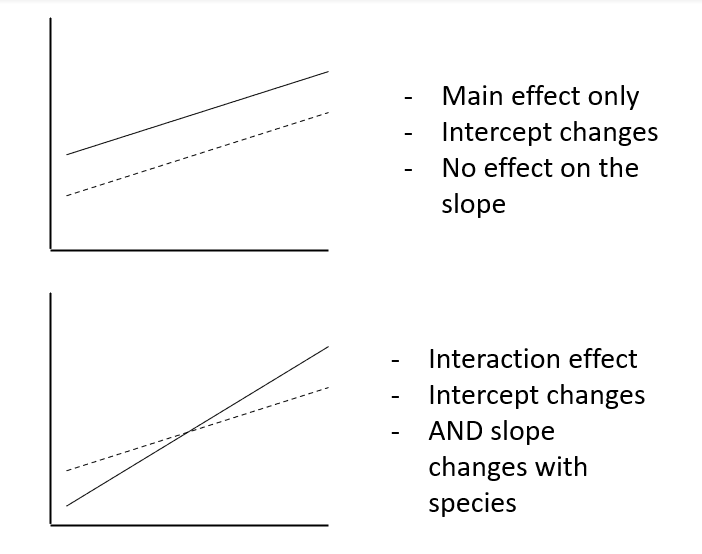

```{r setup, include=FALSE}
knitr::opts_chunk$set(echo = TRUE, warning=FALSE, message=FALSE)
library(tidyverse)
```


# 1. Data with non-normal distributions

In our previous analyses we have worked extensively with the general linear model `lm()`. This regression analysis uses normal/ordinary least squares to fit a **straight line regression**. 

However, as we have already seen, this type of analysis cannot account for *curvature* in our relationships - e.g. bacterial growth rates. And this will be very clear when we produce model diagnostic plots.

Ultimately this will lead to inaccurate measures of error and incorrect estimates. 

We can often use data transformation to correct for this. Commonly we can `sqrt()` or `log10` or `log()` (the natural log) our data in order to approximate a linear relationship and fit an accurate model. But sometimes we will encounter distributions which can never approximate a normal distribution.

## 1.1 Generalized Linear Models

Some data will be non-normally distributed even with a data transformation. The two most common types of data you will encounter like this are:

## 1.2 Count data

**Whole integers (0,1,2,3 etc.)**

This type of data is **discrete** and **non-negative** 

e.g. the number of parasites per microlitre of blood in a bird, the number of insects in a pitfall trap, or the number of cars to cross a bridge per hour. And is usually some sort of count or rate data (count over a set period of observation).

In these cases an assumption of a normal distribution is typically not sensible. Instead we use a different type of distribution, the **Poisson** distribution which lets us explicitly model count data.

## 1.3 Binary data

***discrete** and **bounded by 0 and 1** 

Binary data resembles count data in that they are comprised of **discrete** values, *except* there are only two possible outcomes - one or zero. 

e.g. passing or failing an exam, voting yes or no in a referendum, survival data: alive or dead (whether a chick has fledged or been predated), or a covid-test: negative or positive. 

In these cases again an assumption of a normal distribution is not sensible. The data is constrained by 0 and 1, and can *only* occupy those two positions. Instead we a use a different type of distribution, the **Binomial** distribution, which lets us explicitly model binary or proportion data (anything bounded by 0 and 1).


# 2. Poisson GLM for count data

```{r , echo=FALSE, out.width="200%"}
knitr::include_graphics("img/03-cuckoo.png")
```

In a study by [Kilner *et al.* (1999)](https://www.nature.com/articles/17746), the authors studied the begging rate of nestlings in relation to total mass of the brood of **reed warbler** and **cuckoo** chicks. 

Our question of interest here is **How does nestling mass affect begging rates between the different species?**

```{r}
cuckoo <- read_csv("data/cuckoo.csv")
```

Note we are skipping our usual data structure checks here:  

```{r, eval=FALSE}
head(cuckoo)
```

```{r, echo=FALSE}
cuckoo %>% 
  head() %>% 
  head() %>% 
  kableExtra::kbl() %>% 
  kableExtra::kable_classic(full_width=F)

```


The data columns are:

- **Mass**: nestling mass of chick in grams

- **Beg** : number of begging calls over 6 seconds

- **Species**: Warbler or Cuckoo

```{r}
ggplot(cuckoo, aes(x=Mass, 
                   y=Beg, 
                   colour=Species)) + 
  geom_point()

```

**ALWAYS** start by visualising your data **first**. 

If we plot the data there seems to be a relationship between mass and begging calls and it could be different between species. This allows us to **develop our hypotheses** and choose the **structure of your model**. 

## 2.1 Fitting an (incorrect) Gaussian model

We could fit a standard linear model to this data `lm()`. 

In fact, this is what the authors of the original paper did; reed warbler chicks (solid circles, dashed fitted line) and cuckoo chick (open circles, solid fitted line):

```{r, echo=FALSE,  out.width="80%"}
knitr::include_graphics("img/original.png")
```

This model is inadequate because it predicts **negative** begging calls *within* the range of observed data e.g. for a cuckoo chick weighing 10g (which was observed) their is a prediction of negative begging. 

Let us first attempt to fit this *incorrect* model and display the model diagnostics for this plot

$fit \text{ <- }lm(Beg ~ Mass+Species+Mass:Species, data=cuckoo)$

```{r}
fit <- lm(Beg ~ Mass+Species+Mass:Species, data=cuckoo) 

par(mfrow=c(2,2))
plot(fit, col="darkgrey")

```
<details><summary>**Question - What can you diagnose from these plots?**

- Normality 

- Equal variance of residuals

- Independence of the residuals

- Influential outliers

</summary>

- Normality 

**Not terrible but some signs of overdispersion**

- Equal variance of residuals

**Definitely not! The residual plot depicts a clear "funnel". The model assumption is badly violated, and we can see that as the mean increases so does the variance**

- Independence of the residuals

**Mostly ok, but difficult to say for sure because of the strong heteroscedasticity (see above). A subtle slope pattern is visible in the bottom left. This is cause by the bounding of the data at zero - but the model predicts negative values.**


- Influential outliers

**At least one influential outlier**

</details>

## 2.2 Count data

Because we know our data is **classic count data** - discrete and bounded by zero. We can try a **Poisson** model with a **log** link function instead. 

Log is the default "best fit" link for a Poisson distribution 

other terms which 'can' be substituted are

- "sqrt"

- "identity"

$log\lambda = \beta0 + \beta1*Mass+\beta2*Species$


<details><summary>**Question - Should we include an interaction term in our model?**

- Check the slope of the line

- Think about whether it is reasonable that species might *change* the relationship between mass and begging calls. 

</summary>

- Check the slope of the line

**Evidence of an interaction effect the relationship between Mass and calling appears to change by species**

```{r, echo=FALSE}

```


- Think about whether it is reasonable that species might *change* the relationship between mass and begging calls.

**Yes, we can write a hypothesis that the type of bird species might change the relationship between mass and begging calls. So we will start by including this interaction in our model to check its significance**


$log\lambda = \beta0 + \beta1*Mass+\beta2*Species+\beta3*(Mass*Species)$

</details>


## 2.3 Fitting a Poisson model

$$\begin{aligned}
\text{count_model} \text{ <- }glm(Beg ~ Mass+Species+Mass:Species,  \\ family=poisson (link= \text{‘log’}), data=cuckoo)
\end{aligned}$$

```{r,  eval=FALSE}
count_model <- glm(Beg ~ Mass+Species+Mass:Species, data=cuckoo, family=poisson(link="log"))

summary(count_model)
```

```{r, echo=FALSE}
count_model <- glm(Beg ~ Mass+Species+Mass:Species, data=cuckoo, family=poisson(link="log"))
broom::tidy(count_model, conf.int=T) %>% 
  kableExtra::kbl() %>% 
  kableExtra::kable_minimal()

broom::glance(count_model) %>% 
    kableExtra::kbl() %>% 
  kableExtra::kable_minimal()
```

A reminder of how to interpret the regression coefficients of a model with an interaction term

- Intercept = $\beta 0$ (intercept for the **reference\baseline** so here the log of the mean number of begging calls for **cuckoos** when mass = 0)

- Mass = $\beta1$ (slope: the change in the log mean count of begging calls for every gram of bodyweight for **cuckoos**)

- SpeciesWarbler = $\beta2$ (the increase/decrease in the **intercept** for **warblers** relative to cuckoos) 

- Mass:SpeciesWarbler =$\beta3$ (the increase/decrease in the **slope** for **warblers** relative to cuckoos)

```{r}

par(mfrow=c(2,2))
plot(count_model, col="darkgrey")

```

Data appears to fit a poisson distribution better than a linear distribution. 

## 2.4 Overdisperson

There is one **extra** check we need to apply to a Poisson model and that's for **overdispersion**

Poisson (and binomial models) assume that the variance is *equal to the mean.*  

However, if there is **residual deviance that is bigger than the residual degrees of freedom** then there is *more* variance than we expect from the prediction of the mean by our model. 

Overdispersion can be diagnosed by $\frac{residual~deviance}{residual~degrees~of~freedom}$ which from ourexample here 'summary()' is $\frac{562.08}{54} = 10.4$

Overdispersion statistic values **>1 = Overdispersed**

Overdispersion as a result of larger than expected variance can affect our ability to calculate confidence intervals. 

Luckily a simple fix is to fit a *quasi-likelihood* model which accounts for this. 

```{r,  class.source = "fold-show"}
count_model <- glm(Beg ~ Mass+Species+Mass:Species, data=cuckoo, family=quasipoisson(link="log"))

```
As you can see, while none of the estimates have changed, the standard errors (and therefore our confidence intervals) have. Because of this change in the confidence of our estimates. The interaction effect appears to no longer be significant, now that we have more reliable standard error.

## 2.5 Summary ANOVA tables

We can run an ANOVA to check this.

```{r, eval=FALSE}
main_effect_count_model <- glm(Beg ~ Mass+Species, data=cuckoo, family=quasipoisson(link="log")) ### model without the interaction term but otherwise specified in an identical way
anova(count_model, main_effect_count_model, test="Chi") ### fits type 1 sums of squares to compare the two models

### note for Poisson and Binomial models (integers) we use a "Likelihood ratio Chi square test" not an F-test as we do for general linear models.
### This because we are not using ordinary least squares to fit these models (which assumes normal distribution).

```
```{r, echo=FALSE}
main_effect_count_model <- glm(Beg ~ Mass+Species, data=cuckoo, family=quasipoisson(link="log"))
Models <- c("Model 1 - Beg ~ Mass + Species + Mass:Species", "Model 2 - Beg ~ Mass + Species")
p <- anova(main_effect_count_model, count_model, test="Chi")

cbind(Models, p) %>% 
kableExtra::kbl() %>% 
  kableExtra::kable_minimal()
```

It would appear we **cannot** drop the interaction term *without* significantly affecting the fit of our model.

So we will keep this as our model


<details><summary>Q. If we have a model with interactions in it, which Sum of Squares should we use to report? Type 1, II or III?</summary>

Type I - compare the effect of removing an interaction or main effect from a model - useful for justifying model simplification.

Type II - Most accurate for describing a model with main effects only.

**Type III - Most accurate for describing main effects and interactions when there is an interaction term in the model.** 

```{r, eval=FALSE}
### anova() and aov() both use type I

car::Anova(count_model, type="III") ### car::Anova can do Type II or Type III
      
```

```{r, echo=FALSE}
car::Anova(count_model, type="III") %>% 
  kableExtra::kbl() %>% 
  kableExtra::kable_minimal() 
```

</details>

## 2.6 Writing up the hypothesis testing for an interaction

<details><summary>**Example write up**</summary>

This would be a good example of a hypothesis you might test in your write-ups. 

**Testing the interaction of species and body mass on begging calls**

I hypothesised that the way in which mass influences begging calls would vary by species. Cuckoos are a parasitic bird species which attempts to manipulate its host "parents" into exhausting themselves to feed it, and may continue to request food even after fledging. 

To test this hypothesis I compared body mass in grams as a continuous variable and species (Warbler or Cuckoo) as a factorial predictor, and an interaction term of these two predictors to the rate of begging calls as a count across a six second observation period. This was fitted as a generalised linear model with a poisson error distribution and a "log-link" to the response variable. A quasi-likelihood model was fitted to account for over-dispersion. 

I found that there was a significant interaction effect of Mass and Species ($\chi^2$ ~1,54 = 11.76, *P* = >0.001), suggesting that the relationship between increasing mass and the rate of begging is broadly the same across both species. 

</details>

## 2.7 Estimates and Intervals

Remember that not only is this **Poisson** model fitting variance using a Poisson and not Normal distribution. It is also relating the predictors to the response variable with a "*log-link*" this means we need to exponentiate our estimates to get them on the same scale as the response (y) variable. Until you do this all the model estimates are logn(y).

```{r}
exp(coef(count_model)[1]) ### Intercept - Incidence rate at x=0

exp(coef(count_model)[2]) ### Change in the incidence rate with Mass

exp(coef(count_model)[3]) ### Change in the incidence rate intercept by Species

exp(coef(count_model)[4])

```

Luckily when you tidy your models up with `broom` you can specify that you want to put model predictions on the response variable scale by specfiying exponentiate=T which will remove the log transformation, and allow easy calculation of confidence intervals. 


```{r, eval=FALSE}
broom::tidy(count_model, 
            exponentiate=T, 
            conf.int=T)

```

```{r, echo=FALSE}
broom::tidy(count_model, 
            exponentiate=T, 
            conf.int=T) %>% 
    kableExtra::kbl() %>% 
  kableExtra::kable_minimal() 
```


```{r, eval=FALSE}
broom::glance(count_model)
```

```{r, echo=FALSE}
broom::glance(count_model) %>% 
      kableExtra::kbl() %>% 
  kableExtra::kable_minimal()
```

We can use `broom::augment()` to plot the regression lines for each species. We have to specify we want our fitted values to be on the "response" scale otherwise it will default to the "log-link". 

```{r}
broom::augment(count_model, cuckoo, type.predict="response") %>% 
  ggplot(aes(x=Mass,
             y=Beg,
             colour=Species))+
  geom_point(aes(x=Mass,
                 y=Beg,
                 colour=Species))+
  geom_line(aes(x=Mass, y=.fitted))+
  theme_minimal()
```

Because we fitted a straight line on the log-scale of the data we now get a nice exponential curve when we transform it back onto the original scale. 


## 2.8 Estimates and confidence intervals

Remember when report Incidence Rates and Confidence Intervals we capture effect sizes.  

We can use these to talk about the biology which underpins our analyses e.g.

<details><summary> Mass 1.06 (95%CI: 1.05-1.06) </summary>

For every gram of bodyweight gained by a **cuckoo chick** there was an average increase of 1.06 in the rate of begging calls per six seconds. 

or

On average begging rates go up as chicks get heavier

</details>

<details><summary> SpeciesWarbler 0.59 (95%CI: 0.43-0.8) </summary>

Warblers had an average call rate that was *at least* 0.67 higher than that of a Cuckoo of an equivalent weight 

</details>

<details><summary> Mass:SpeciesWarbler 1.02 (95%CI: 1-1.023) </summary>

Warbler's increased their *call-rate* relative to body weight *faster* than cuckoo's. Such that for every gram of weight gained Warbler's add one extra begging call (compared to the increase in cuckoos) to the six-second observation period. 

This accounts for the steeper curve in the warbler begging rate - but note how the warblers clearly leave the nest at a much lower body mass, while the cuckoos continue to beg and grow ultimately much larger! 

Perhaps the steeper rate in begging reflects the faster maturity of the warbler chicks?

</details>


Include these with the F statistics generated from your ANOVA tables, optionally along with R^2^ (total variance explained by the model) - and you have a comprehensive results write-up. 


### 2.8.1 Final thoughts on GLM Poisson

A GLM with a Poisson distribution is a good place to start with, when dealing with integer count data. The default log-link prevents the prediction of negative counts, and the Poisson distribution assumes that variance is equal to the mean - again a good assumption for rate/count data. This distribution works well when we have lots of data with small values (and zeroes) and some very large values. 

If there is overdispersion we can account for this with a quasi-likelihood model.

If you have count data with few low values, then the Poisson distribution can become quite similar to the log transformed general linear model `lm()` and will start to give very similar estimates. 


# 3. Binomial models/Logistic Regression for data bounded between 0 and 1. 

When our response variable is binary, we can use a glm with a **binomial** error distribution


## 3.1 [The Challenger Disaster](https://en.wikipedia.org/wiki/Space_Shuttle_Challenger_disaster#O-ring_concerns)

In 1985, NASA made the decision to send the first civilian into space. 

This decision brought a huge amount of public attention to the STS-51-L mission, which would be Challenger’s 25th trip to space and school teacher Christa McAuliffe’s 1st. On the afternoon of January 28th, 1986 students around America tuned in to watch McAuliffe and six other astronauts launch from Cape Canaveral, Florida. 73 seconds into the flight, the shuttle experienced a critical failure and broke apart in mid air, resulting in the deaths of all seven crewmembers: Christa McAuliffe, Dick Scobee, Judy Resnik, Ellison Onizuka, Ronald McNair, Gregory Jarvis, and Michael Smith.

After an investigation into the incident, it was discovered that the failure was caused by an O-ring in the solid rocket booster. Additionally, it was revealed that such an incident was foreseeable.

In this half of the worksheet we will discuss how the right statistical model could have predicted the critical failure of an O-ring on that day. 


```{r, echo=FALSE,  out.width="60%"}
knitr::include_graphics("img/space-shuttle.jpg")
```

Read in the data


Start by reading in the dataset

```{r, eval=FALSE}
Challenger <- read_csv("data/Challenger.csv")
head(Challenger)
```


```{r, echo=FALSE}
Challenger <- read_csv("data/Challenger.csv")
Challenger %>% 
  head() %>% 
  kableExtra::kbl() %>% 
  kableExtra::kable_classic(full_width=F)
```

The data columns are:

- **oring_tot**: Total number of orings on the flight

- **oring_dt** : number of orings that failed during a flight

- **temp**: Outside temperature on the date of the flight

- **flight** order of flights


## 3.2 Visualising data

Always remember one of the FIRST things you should do with any dataset is visualise it. 

Visualising your data helps you understand it, and helps you plan your hypotheses and the appropriate models to test your hypotheses. 

### 3.2.1 Oring concerns 

It was frequently discussed issue that temperature might play a role in the critical safety of the o-rings on the shuttles.
One of the biggest mistakes made in assessing the flight risk for the Challenger was to only look at the flights **where a failure had occurred**

```{r}
Challenger %>% 
  filter(oring_dt > 0) %>% 
ggplot(aes(y=oring_dt, x=temp))+geom_point()+
  ggtitle("Temperature on flight launches where an O-ring incident occurred")
```
From this it was concluded that temperature did not appear to affect o-ring risk of failure, as o-ring failures were detected at a range of .


From this it was concluded that temperature did not appear to affect o-ring risk of failure, as o-ring failures were detected at a range of different temperatures.

However when we compare this to the full data that was available a very different picture emerges. 


```{r}
Challenger %>% 
ggplot(aes(y=oring_dt, 
           x=temp))+
  geom_point()+
  geom_smooth(method="lm")+
  ggtitle("All launch data")
```


When we include the flights without incident *and* those with incident, we can see that there is a very clear relationship between temperature and the risk of an o-ring failure. It has been argued that the clear presentation of this data *without* should have allowed even the casual observer to determine the high risk of disaster (Tufte 1997 *Visual Explanantions*).

However if we want to understand the actual relationship between temperature and risk then there are several issues with fitting a linear model here - once again the data is an integer, and bounded by zero (our model predicts negative failure rates within the observed data range). 

We COULD consider this as suitable for a Poisson model - but if we are really interested in determining the risk of **having a flight with o-ring failure vs. no failure**. Then we should implement a GLM with a Binomial distribution.

### 3.2.2 We can use dplyr to generate a binary column of no incident '0' and fail '1' for anything >0. 

```{r}
Challenger <- Challenger %>% 
  mutate(oring_binary = ifelse(oring_dt =='0', 0, 1))
```

In this case *p* represents the probability of an o-ring failure and *1-p* represents the probability of no incident. We know this because now there are only two possible outcomes. 


## 3.3 Fitting a binary GLM and generate log-odds estimates

```{r, echo=FALSE}
binary_model <- glm(oring_binary~temp, family=binomial, data=Challenger)
binary_model %>% broom::tidy(conf.int=T)
```

```{r, eval=FALSE}
binary_model <- glm(oring_binary~temp, family=binomial, data=Challenger)
broom::tidy(binary_model, conf.int=T) %>% 
  kableExtra::kbl() %>% 
  kableExtra::kable_minimal()

```

So we are now fitting the following model

$$
 Y \sim Bern(p)
$$


$$
\log\left[ \frac { P( \operatorname{oring\_binary} = fail) }{ 1 - P( \operatorname{oring\_binary} = fail) } \right] = \beta_{0} + \beta_{1}(\operatorname{temp})
$$


Which in R will look like this

oring_binary~temp, family=binomial, data=Challenger

$$\begin{aligned}
\text{binary_model} \text{ <- }glm(\text{oring_binary~temp},  \\ family=binomial (link= \text{‘logit’}), data=Challenger)
\end{aligned}$$


- Intercept = $\beta_{0}$ = 23.77

When the temperature is 0&deg;F the *log-odds* are 23.77 for a failure incident in the O-rings

- Temp = $\beta_{1}$ = -0.37

For every rise in the temperature by 1&deg;F, the *log-odds* of a critical incident fall by 0.37.


### 3.3.1 Odds and Odds ratios

Odds and Odds ratios are counter-intuitive and most people find them difficult to work with.

You need to know that your model fits a regression line to the **log-odds**, but we will work with probability instead.

If you want to find out more about odds and odds ratios you can find more information here at [StatQuest](https://www.youtube.com/watch?v=8nm0G-1uJzA)


## 3.4 ANOVA table

We can see that the effect of temperature appears to be highly significant and we can present the likelihood ratio summary with ANOVA tables. 

```{r}
kableExtra::kbl(car::Anova(binary_model, type="II")) %>% 
  kableExtra::kable_minimal()
```


## 3.5 Interpreting estimates for probability

A more intuitive way to understand the binary GLM, is to make the conversion from odds to probability, there are multiple ways to do this & we will run through a few methods. 

### 3.5.1 Calculating probability using the model estimates

```{r, echo=FALSE}

Challenger %>% 
summarise(mean=mean(temp)) %>% 
  kableExtra::kbl()

```

Let's work out the base-level risk of O-ring failure for the mean temperature on launch day 69.6&deg;F


### 3.5.2 Emmeans

If we use the `emmeans()` function it will estimate the probability of o-ring failure at the mean value of x (temperature).
But how does it do this?

```{r}
emmeans::emmeans(binary_model, specs=~temp, type="response")
```


### 3.5.3 Working it out manually

This is the equation to work out probability using the **exponent** of the linear regression equation:

$$
P(\operatorname{risk of failure at }  X=69)\left[ \frac{e^{23.77+(-0.37 \times 69.6)}}{1+e^{23.77+(-0.37 \times 69.6)}} \right]
$$

Which produces the following result and we can confirm the risk of an o-ring failure on an *average* day is 0.15

```{r}
estimate_at_69.6 <- exp(coef(binary_model)[1]+coef(binary_model)[2]*69.6)

estimate_at_69.6/(1+estimate_at_69.6)

```


```{r, eval=FALSE}
logit2prob <- function(x){
  exp(x)/(1+exp(x))
}

logit2prob(coef(binary_model)[1]+coef(binary_model)[2]*69.6)

### Writing a function to perform the task

```

### 3.5.4 Estimating the change in probability with x

We will also be interested in how the risk *changes* with temperature. 

To do this we can compare the estimated probability of failure *between* two temperatures

```{r}
estimate_at_70.6<- exp(coef(binary_model)[1]+coef(binary_model)[2]*70.6)

estimate_at_69.6-estimate_at_70.6

```
In this instance we can say that a rise in one degree of the outside air temperature has decreased the risk of O-ring failure by 5%.


### 3.5.5 The 'divide-by-four' rule

A useful *rule-of-thumb* can be the **divide-by-four** rule.

This can be described as the **maximum** difference in probability for a unit change in $X$ is $\beta/4$.

In our example the **maximum difference** in probability from a one degree change in Temp is $-0.37/4 = -0.09$

So the **maximum difference** in probability of failure corresponding to a one degree change is 9%


### 3.5.6 Augment your data

Probably the way in which you will mostly work with binomial models is using `broom::augment()` if you specify predictions on the "response" scale you can easily access the probabilities of 0-ring failure for each observed temperature in the dataset

```{r}
augmented_model <- broom::augment(binary_model,Challenger, type.predict="response",se_fit=T)

augmented_model %>% 
        head() %>% 
kableExtra::kbl() %>% 
  kableExtra::kable_minimal()
```


<details><summary>**Advanced TASK - add confidence intervals**</summary>

It is possible to add confidence intervals to predictions on the exisiting (or any new dataset) using `augment` but it becomes a little convoluted for binomial models.

**The easy (but slightly wrong way)**

We can assume 1.96 * the Standard Error will produce our 95% confidence intervals. This will be broadly correct for large enough sample sizes, but might also occasionally do odd things like allow confidence intervals to be >1 or <0. 

```{r}

broom::augment(binary_model,Challenger, type.predict="response",se_fit=T) %>% 
    mutate(.lower = .fitted - 1.96*.se.fit,
           .upper = .fitted + 1.96*.se.fit) %>% ggplot(aes(x=temp, y=oring_binary))+geom_line(aes(x=temp, y=.fitted))+geom_line(aes(x=temp, y=.upper), linetype="dashed")+geom_line(aes(x=temp, y=.lower), linetype="dashed")+geom_point()

```


**The correct (but more involved way)**

We know that GLMs fit regressions through family and link functions. For any model you specify it is possible to extract these

```{r}
fam <- family(binary_model)
ilink <- fam$linkinv
```


If you then augment your data with the model **but** do not specify response, you can manually use the link function to convert your estimate back into the response scale, BUT importantly also transform the S.E. properly.

Don't worry if this is a lot to get your head around - the main thing is whether you could use this code to produce 95% CI. 

```{r}
broom::augment(binary_model,Challenger,se_fit=T)%>%
    mutate(.lower = ilink(.fitted - 1.96*.se.fit),
           .upper = ilink(.fitted + 1.96*.se.fit), exp.fitted=ilink(.fitted)) %>% 
  ggplot(aes(x=temp, y=oring_binary))+geom_line(aes(x=temp, y=exp.fitted))+
  geom_ribbon(aes(ymin=.lower, ymax=.upper), alpha=0.2)
```

</details>


## 3.6 Make new predicitons

On the day the Challenger launched the outside air temperature was 36&deg;F

We can use augment to add our model to new data - and make predictions about the risk of o-ring failure

First - we make a new dataset with the temperature on the day of the Challenger Launch **36&deg;F**

```{r}
new_data <- tibble(temp=36, oring_binary=1)
new_data

```


Now we can use the augment function to fit our model - fitted using our original data - and map it to this new data. 

```{r}
augmented_new_data <- broom::augment(binary_model, newdata = new_data, type.predict = "response", se_fit=T)
augmented_new_data 
```

From this we can see their was a greater than 99.99% probability of o-ring failure on that fateful day. 


We can also present this data visually: 


```{r, fig.cap="Figure 1. Estimated risk of O-ring failure with daily ambient temperature for NASA Shuttle launches. The dashed line represents the estimated mean risk of o-ring failure fitted with a GLM with a binomial error distribution and a logit link, the grey shaded area is the 95% confidence interval. Points represent recorded datapoints of launches with and without o-ring incidents and the red datapoint indicates the Challenger disaster."}

augmented_new_data <- broom::augment(binary_model, newdata = new_data, se_fit=T) ### new data on link scale

augmented_old_data <- broom::augment(binary_model,Challenger, se_fit=T) ## old data on link scale

augmented_full_data <- augmented_new_data %>% full_join(augmented_old_data) ### full join combines the datasets

augmented_full_data %>% 
    mutate(.lower = ilink(.fitted - 1.96*.se.fit),
           .upper = ilink(.fitted + 1.96*.se.fit), exp.fitted=ilink(.fitted)) %>%  ### see ADVANCED TASKS
  ggplot(aes(x=temp, y=exp.fitted))+
  geom_point(aes(x=temp, y=oring_binary), colour="red")+
  geom_ribbon(aes(ymin=.lower, ymax=.upper), alpha=0.2)+   ### Fits one shape to display confidence interval
  geom_line(linetype="dashed", width=1.5)+
  theme_minimal()+
  gghighlight::gghighlight(temp<40, 
                           unhighlighted_colour = alpha("darkgrey",0.9))+   ### emphasise particular data
  geom_label(label="Challenger",    ### add custom labels
             nudge_x=3.5, 
             nudge_y=-0.05
             )+
  labs(x=expression(paste('External Air Temperature (',~degree,'F)', sep='')), 
                    y="Risk of O-ring failure")+
  ggtitle("Model predictions for the risk of O-ring failure \nwith changing external air temperature")
  
  


```


```{r, fig.cap="Figure 1. Estimated risk of O-ring failure with daily ambient temperature for NASA Shuttle launches. The dashed line represents the estimated mean risk of o-ring failure fitted with a GLM with a binomial error distribution and a logit link, the grey shaded area is the 95% confidence interval. Points represent recorded datapoints of launches with and without o-ring incidents and the red datapoint indicates the Challenger disaster.", eval=FALSE}

broom::augment(binary_model,Challenger, type.predict="response",se_fit=T) %>% 
  ggplot(aes(x=temp, y=.fitted))+
  geom_point(aes(x=temp, y=oring_binary))+
  geom_point(aes(x=temp, y=.fitted),
                 colour="red",
             data=augmented_new_data)+
  geom_smooth(method="glm",                             #### here we can see that you can fit simple models with geom_smooth
              method.args=list(family="binomial"),      ### the alternative to this is to fit your custom model broom::augment as shown                                                                      previously
              fullrange=T,
              colour="black",
              fill="lightgrey",
              linetype="dashed")+
  theme_minimal()+
  gghighlight::gghighlight(temp<40, 
                           unhighlighted_colour = alpha("steelblue",0.6))+   ### emphasise particular data
  geom_label(label="Challenger",    ### add custom labels
             nudge_x=3.5, 
             nudge_y=-0.05,
             data=augmented_new_data)+
  labs(x=expression(paste('External Air Temperature (',~degree,'F)', sep='')), 
                    y="Risk of O-ring failure")+
  ggtitle("Model predictions for the risk of O-ring failure \nwith changing external air temperature")
  
```  


## 3.7 Check your model

Checking the Binary GLM is less straightforward than other models as it is not expected to produce normally distributed residuals. 

```{r}

par(mfrow=c(2,2))
plot(binary_model, col="darkgrey")

```

Instead we only care about two things

- Non-independence of the residuals with x

- Binned residuals for overdispersion

```{r}
plot(binary_model, col="darkgrey", which=1)

arm::binnedplot(augmented_model$.fitted,augmented_model$.resid)

```

- Here we can see that there is a slight slope in our residuals (we expect two groups but ideally points would be horizontal), this might indicate another predictor variable at work, but we have nothing else to work with in our dataset

- The binned residual plot tests for over-dispersion (we cannot use the ratio of residual deviance to residual DF because of the constrained nature of the data). This approach works better with more data so is not much use here. Ideally we want residual points within the grey lines (2*Standard errors of the binned residuals). 


# 4. Summary

**GLMs** are powerful and very flexible

Model checking can become trickier

As a general rule

- General linear models `lm()` can be used for linear regression with data that has an expectation of normal distribution

- Data with a non-normal distribution can be transformed to make it fit an ordinary least squares (General Linear Model).

- Or you can try a GLM with a gaussian distribution and change the link if you want to 'internalise' the transformation

- Count/Rate data requires a Poisson error distribution

- Proportion or Binary data requires a Binomial error distribution


```{r, echo=FALSE}
knitr::kable(rbind(
                    c("Gaussian","identity", "log/inverse"),
                    c("Poisson", "log", "identity/sqrt"),
                    c("Binomial", "logit", "probit/cauchit/log/cloglog")),
              caption = 'Generalised Linear Models',
              col.names = c("Error Family", "Standard Link", "Available links"),
) %>% 
  kableExtra::footnote(general = "This is not the full range of Error families available") %>% 
   kableExtra::kable_paper("hover", full_width = F) %>% 
   kableExtra::pack_rows(index=c("Continuous"=1, "Discrete"=2))
```

## 4.1 Extensions

There are many extensions to Generalised Linear Models which we won't develop on this module, but you might encounter in the future

- **Mixed Models**

- **Survival models**

- **Generalized Additive Models**

And there are other types of models which do not use the linear framework

- **Principal Component Analysis**

- **Cluster Analysis**

There are also methods of *training* and *refining* models known as **machine learning**

This is where you train a machine/algorithm using a "training dataset" before applying the model to new data. Its biggest distinction from the focus of statistics is maximising accurate predictions over inferring underlying relationships. It can be broadly split into two categories. 

- These can be **supervised** - we provide a rigid framework for the learning e.g. linear regression

- Or **unsupervised** - like cluster analysis

So by learning regression techniques you are also part-way towards developing supervised machine learning techniques as well. 


